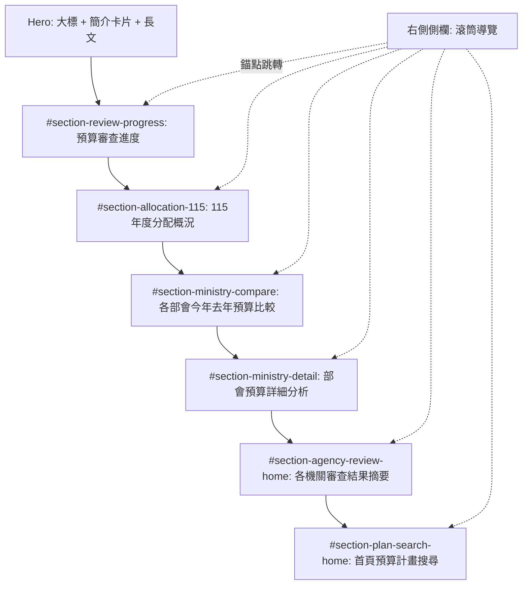

# 總預算儀表板新設計 — 完整 SPEC

---

## 1. 專案範圍

- **目標**: 將現行 `index.html` 的所有功能與內容，完整映照到新設計 `pencil-new.pen`，補齊導覽、互動、資料來源、RWD 規格。
- **不變前提**:
  - 資料來源維持 Google 試算表（同一 `FILE_ID`，多個 `gid`）。
  - 圖表仍使用 Chart.js 動態繪製，Pencil 設計為視覺與 layout 參考。
- **設計策略**:
  - 已有 Pencil wireframe 的區塊 → 直接對應新設計。
  - 無 Pencil 新設計的畫面（立委頁、各 modal、系統狀態） → 沿用原 layout，套上 Pencil 風格（色彩、字級、圓角、間距）。

---

## 2. 頁面結構

### 2.1 首頁 (`#home`)（立委總覽改至立委把關分頁）

### 2.2 預算審查分頁 (`#page-budget`)

- 各機關審查結果分析（完整版儀表板）
- 預算計畫搜尋（完整搜尋 + 結果列表 + 分頁）
- 熱門關鍵字 chips（僅此頁）
- 排行榜（部會 / 計畫 Top5）

### 2.3 立委把關分頁 (`#page-legislator`)

- **立委總覽摘要**（Top 5，可切換排序：刪減案數 / 凍結案數）— 置於此分頁頂部或顯眼區塊
- 立委卡片 grid + 黨籍篩選 + 排序選項
- 立委詳情 modal

---

## 3. Header Nav（sticky）

- **導覽項目（順序）**:

  1. 相關新聞 → **外連** `https://www.cna.com.tw/topic/newstopic/3958.aspx`（中央社總預算主題，開新分頁）
  2. 立委把關 → 切頁到 `#page-legislator`
  3. 預算審查進度 → 錨點 `#section-review-progress`
  4. 115 年度預算案分配概況 → `#section-allocation-115`
  5. 預算計畫搜尋 → `#section-plan-search-home`
  6. 各機關審查結果 → `#section-agency-review-home`
  7. 各部會今年去年預算比較 → `#section-ministry-compare`
  8. 部會預算詳細分析 → `#section-ministry-detail`

- **點擊展開選單**: Nav 為點擊展開式選單，展開後顯示上述全部項目。
- **樣式**: 沿用現有字級與風格；寬度不足時隱藏末尾項目。
- **簡易搜尋入口**: Nav 內含搜尋框，結果直接在首頁 `#section-plan-search-home` 顯示。

---

## 4. 首頁右側側欄（非 sticky，滾筒效果）

### 4.1 基本規則

- **出現位置**: 僅在首頁 `#home`。
- **不 sticky**: 隨頁面內容捲動。
- **內容**: 與 Nav 相同 8 項。
- **行為分類**:
  - 相關新聞: 外連。
  - 立委把關: 切頁到 `#page-legislator`。
  - 其餘 6 項: 同頁錨點瞬間跳轉。

### 4.2 滾筒效果

- **紅色箭頭**: 固定在側欄中間位置，作為「當前選取項目」的視覺指針。
- **可點選規則**: 只有正對紅色箭頭的那一項可被點擊；其餘項目不可點擊，僅供參考。
- **透明度階梯**:
  - 箭頭所在項 = **100%**
  - 相鄰 ±1 = **70%**
  - 再下一級 = **40%**
  - 更遠 = 依此遞減或維持最低值
- **捲動操作**:
  - 使用者可用滑鼠滾輪 / touchpad 在側欄內捲動清單。
  - **可 loop 捲動**（到清單底部後接續清單頂部，繞圈圈）。
  - **一次滾動 1 個 item**。
  - 捲動到目標項目對齊紅箭頭後，點擊觸發頁面跳轉。
- **錨點判定（頁面捲動時同步）**: 以 **viewport 中線** 判定哪個 section 被視為「目前所在」，側欄清單自動滾動使對應項目對齊紅箭頭。

### 4.3 浮動回首頁按鈕

- **位置**: 右下角懸浮（全站共用）。
- **行為**: 點擊回首頁頂部。
- **手機**: 縮小尺寸或位移，避免遮擋內容。

---

## 5. 首頁各 section 規格

### 5.1 Hero / Intro

- **Pencil 對應**: 第一個 `home` frame（例如 id: `YoHzd`）。
- **內容**: 主標題 + 簡介卡片 + 三段說明長文。
- **設計**: 上半部 = hero + 大圖 + 側邊導覽；下半部 = intro（大標 + 簡介卡片 + 長文段落）。

### 5.2 預算審查進度（`#section-review-progress`）

- **Pencil 對應**: `Wireframe - 2`。
- **組成**:
  1. 文案說明。
  2. 時間軸 `#budget-timeline`: 保留現有資料（日期 + 事項 + 連結），Pencil 風格。**取消** wireframe 中額外 legend、特殊 marker、多條法定完成期限線。
  3. 總審查比例圖 `#chartStatusB`: Chart.js 動態繪製，Pencil 風格。不與 summary 卡做 hover 連動。
- **首頁 summary 卡**（**資料來源已明確指定，對應 §10**）:
  - 純數字展示，不可點擊，不連動其他區塊。
  - 顯示:
    - 「已刪減 NT$ X 億 ▲ 較去年 +Y%」
    - 「已凍結 NT$ Z 億 ▲ 較去年 +W%」

### 5.3 115 年度預算案分配概況（`#section-allocation-115`）

- **Pencil 對應**: `Wireframe - 11`。
- **內容**: 政事別說明文 + `#chartAllocation` + `#chartAllocationLegend` + `#bill-info-overlay`。
- **互動**: 圖例可點擊切換高亮與 pointer 指向；overlay 顯示金額與描述。維持現有邏輯，Pencil 風格。

### 5.4 各部會今年去年預算比較（`#section-ministry-compare`）

- **Pencil 對應**: `Wireframe - 7`。
- **內容**: 歲出與歷年趨勢說明文 + `#chartYearly`。
- **互動**: hover 顯示該年詳情（tooltip）；click 可高亮該年或切換年度連動。

### 5.5 部會預算詳細分析（`#section-ministry-detail`）

- **版面**:
  - **左欄**: 上方 = 今年/去年預算數字 + 增減幅度；下方 = 圓餅圖（部會或機關的預算分配比例）。
  - **右欄**: 長條圖，每一條 bar 代表一個部會下轄機關，堆疊顯示「通過 / 凍結 / 刪減」比例。若機關數量超出容器，**內部可 scroll，不隱藏**。
- **下拉選單邏輯**（沿用現有）:
  - 選部會 → 右欄列出全部該部會的機關 bar；左欄顯示部會整體。
  - 選特定機關 → 左欄切為該機關視角，右欄高亮該機關 bar。
- **國防部特殊校正**: 維持現有 `calculateAgencyStats` 邏輯。

### 5.6 各機關審查結果摘要（`#section-agency-review-home`）

- **Pencil 對應**: `Wireframe - 12` 的精簡版。
- **內容**:
  - 一句摘要說明（「中央政府總預算包含…透過下方互動式圖表…」）。
  - 部會 / 機關下拉（Pencil 風格：圓角白底灰框）。
  - 一個審查比例圖（stacked bar: 通過 / 凍結 / 刪減）。
  - 可選：三個小 stat（刪減案 / 凍結案 / 主決議）。
  - 不放 project-block 列表（完整版在 `#page-budget`）。
- **互動**: 選部會或機關 → 更新圖表；可加「看完整分析」按鈕連到 `#page-budget`。

### 5.7 首頁預算計畫搜尋（`#section-plan-search-home`）

- **內容**: 簡易搜尋框 + 搜尋結果列表（簡化版 project-block）。
- **行為**: 不切頁，結果直接在首頁此 section 顯示；click 結果項 → 開計畫詳情 modal（Pencil 風格）。
- **註記**: 「立委總覽摘要」已改至立委把關分頁，見 §7。

---

## 6. 預算審查頁 (`#page-budget`)

### 6.1 各機關審查結果分析

- 部會 / 機關下拉 (`#bp-filter-ministry`, `#bp-filter-unit`)。
- `#chartBudgetPageReview`: 通過 / 刪減 / 凍結比例。
- 資料: page-a + page-b。

### 6.2 預算計畫搜尋（完整版）

- 搜尋框 + 熱門關鍵字 chips（**僅此頁**；來源: log / GA + 中央社報導；click = 帶入搜尋框觸發搜尋）。
- 結果列表 `#results-container-budget`（project-block 卡）+ 分頁 `#pagination-budget`。
- click project-block → 計畫詳情 modal（Pencil 風格）。

### 6.3 排行榜（部會 / 計畫 Top5）

- 沿用 `processPageBData` 邏輯。
- 每列顯示：部會名 + 計畫名 + 金額 + 刪減 / 凍結標籤（icon 或色塊，風格統一）。
- click 排行列 → 開計畫詳情 modal（Pencil 風格）。

---

## 7. 立委把關分頁 (`#page-legislator`)

- **立委總覽摘要**（置於此分頁）:
  - 內容: Top 5 立委卡片（預設按刪減案數排序）。
  - 可切換: 「刪減案數」與「凍結案數」排序。
  - 互動: 點擊卡片 → 開啟該立委詳情 modal。
  - 小螢幕: 參考 Netflix 片單，橫向滑動卡片。
- **Layout**: 沿用原設計，風格套 Pencil（色彩、字級、間距、圓角）。
- **排序選項**: 可選依刪減案數 / 凍結案數 / 主決議數 / 姓名。
- **黨籍篩選**: 沿用（全部 / 民進黨 / 國民黨 / 民眾黨 / 無黨籍）。
- **立委詳情 modal (`#detailModalC`)**: 原 layout（兩張提案表），風格套 Pencil。不做額外分頁或篩選。

### 7.1 立委頭像（photos）

- **路徑**: 站台根目錄下 `photos/` 資料夾。
  - 檔名規則: `{委員姓名}.jpg`，需與 page-c「委員姓名」欄完全一致（含空格、特殊字元）。
  - 程式端目前預設為 `./photos/${data['委員姓名']}.jpg`。
- **來源**:
  - 由專案或後台維護的靜態檔案，非必須從試算表欄位讀取。
  - 若試算表中已有「照片」欄為 URL，可改為 ``，同時保留本地 fallback。
- **Fallback 規則**:
  - 當 `photos/{委員姓名}.jpg` 不存在或載入失敗時，不顯示破圖 icon。
  - 顯示預設頭像（例如單色剪影或 icon），樣式符合 Pencil 風格。
- **文件說明建議**:
  - 在 `README` 或部署說明中註明需提供 `photos/` 資料夾與對應檔名。
  - 若將來有正式照片 URL 來源，可在 SPEC 補充「照片」欄位使用方式。

---

## 8. 計畫詳情 modal

- **Layout**: 沿用原設計（兩個 tab），風格套 Pencil。
- **Tab 1 - 工作計畫內容**: 計畫標題 / 部會 / 金額 / 工作內容（收合展開）/ 分支計畫按鈕列 / 用途比例圓餅。
- **Tab 2 - 審查刪減結果**: `chartBResult` / `chartBStages` / 提案紀錄表。
- **國防專用分析圖**: 維持現有 4 張圖邏輯，Pencil 風格。
- **入口**: 搜尋結果 project-block / 排行榜列 / 首頁搜尋結果。

---

## 9. 系統狀態（Loading / 錯誤 / Demo）

- **Loading overlay (`#loader`)**: 轉圈圖示 + 文字，Pencil 風格（統一 icon、字型、色彩）。
- **Error overlay (`#error-display`)**: 錯誤訊息，Pencil 風格。
- **Demo badge (`.demo-mode-badge`)**: 「測試資料模式」提示，Pencil 風格。

---

## 10. 資料來源對照

- **FILE_ID**: `1Qft9FVm9XtT3SVzbgX1NSduPP0sBR3CdGqiUsm-Mmrs`

### 10.1 page-a — 基礎預算與工作計畫（gid `612819456`）

- **用途**: 編列預算 / 工作計畫 / 部會比較 / 搜尋 / 政事別。
- **主要欄位**:
  - `所屬部會`
  - `主管機關`
  - `計畫名稱`
  - `預算金額`
  - `114年預算金額`
  - `政事別`
  - `工作內容`
  - `分支計畫`
  - `用途比例`

### 10.2 page-b — 審議刪減 / 凍結（gid `1304436957`）

- **用途**: 審議刪凍 / 排行榜 / 機關審查 / `chartStatusB`。
- **主要欄位**:
  - `主管機關`
  - `計畫名稱`
  - `刪減金額`
  - `凍結金額`
  - `委員會刪減`
  - `委員會凍結`
  - `院會表決刪減`
  - `院會表決凍結`
  - `通案刪減`
  - `通案凍結`
  - `資料類型`
  - （**補充**）`所屬部會`:
    - 若 page-b 有此欄，預算審查頁的部會篩選可直接使用。
    - 若 page-b 無此欄，維持現有程式邏輯：以 `主管機關` 對應 page-a 的部會欄位來推算「所屬部會」。
- **審查階段欄位補充（給 modal 三階段圖表使用）**:
  - `委員會刪減 / 委員會凍結`
  - `院會表決刪減 / 院會表決凍結`
  - `通案刪減 / 通案凍結`
  - 若實際欄位名稱不同（例如僅有「協商刪減 / 協商凍結 / 院會刪減 / 院會凍結」），則作為 fallback，邏輯在程式中標註。

### 10.3 page-c — 立委把關與提案明細（gid `1025885437`）

- **用途**: 立委卡片與提案明細。
- **主要欄位**:
  - `委員姓名`
  - `黨籍`
  - `刪減案數`
  - `凍結案數`
  - `主決議數`
  - `照片`（可選）
  - `刪減案更新時間`
  - `凍結案更新時間`
  - 提案明細相關欄位（如：日期、事項、院會決議、連結等）
- **更新時間補充**:
  - 若試算表僅有單一 `更新時間` 欄，則程式中兩處（對應原本 `刪減案更新時間`、`凍結案更新時間`）皆改為讀取同一欄。

### 10.4 page-d — 時間軸（gid `1462843513`）

- **用途**: 預算審查流程時間軸。
- **主要欄位**:
  - `日期`
  - `事項`
  - `連結`

### 10.5 首頁 summary 卡 — 給美編 xlsx / 115MoneytoGemini

- **來源檔案**: 專案內 `給美編/115年預算案_各機關別_給美編.xlsx`，工作表 **`115MoneytoGemini`**。
- **關鍵欄位**:
  - `general_cut`（通案刪減）
  - `legis_cut`（立委刪減）
  - `legis_freeze`（立委凍結）
- **計算邏輯**:
  - **已刪減總額** = 全表 `general_cut + legis_cut` 加總。
  - **已凍結總額** = 全表 `legis_freeze` 加總。
  - 若欄位為文字（含逗號、單位），需先用類似 `parseMoney` 的邏輯轉為數值。
- **較去年百分比**:
  - 公式: \(\text{成長率} = \left( \frac{\text{115年度已刪減/凍結總額}}{\text{114年度已刪減/凍結總額}} - 1 \right) \times 100\%\)。
  - 114 年總額須備有同口徑資料（例如同一檔的 114 年列或另一個 114 年度工作表），以相同欄位名 (`general_cut`, `legis_cut`, `legis_freeze`) 加總。
- **與網頁程式的串接**:
  - 作法 A（推薦）: 將上述結構發布為 Google 試算表的一個「審議統計」分頁（或同檔案新 `gid`），欄位名維持 `general_cut` / `legis_cut` / `legis_freeze`，前端沿用現有 `fetchData` / `parseQueryResponse` 流程。
  - 作法 B: 在建置流程中預先將 xlsx 轉為 CSV 或 JSON，併入前端可讀取的靜態檔，再由 JS 直接讀取。欄位名同樣維持上述名稱。
  - 無論採用哪一種，**首頁 summary 卡與 `#chartStatusB` 的口徑應一致**：包含「全部工作計畫 + 通案刪減」，與 PDF 第 20 頁描述相符。

---

## 11. RWD 規則（手機 < 768px）

- **Nav**: 預設收合為漢堡選單；展開後顯示完整項目列表。
- **首頁側欄（滾筒）**: 隱藏；改為**頂部 dropdown** 選單替代。
- **浮動回首頁按鈕**: 縮小尺寸或位移至不遮擋內容的位置。
- **首頁立委總覽**: 參考 Netflix 片單，**橫向滑動卡片**。
- **部會分析右欄長條圖**: **不隱藏**，擴長 container（內部縱向可捲動）。
- **排行榜**: 改為單欄（沿用現有 RWD）。
- **部會 / 機關下拉**: 改為上下排列（沿用現有 RWD）。
- **其餘**: 先延用現有 RWD 邏輯，日後再補手機版設計稿。

---

## 12. 計畫邏輯與計算檢視

- **`parseMoney`**: 處理「億 / 萬 / 千」與逗號，數值一致用於圖表與排行榜。
- **`renderHomeStatusChart`**:
  - 總預算 = page-a 加總 + 國防部校正（0901 本部 + 0902 所屬）。
  - 刪減 / 凍結 = page-b 加總。
  - 通過 = 總預算 - 刪減 - 凍結。
- **`calculateAgencyStats`**:
  - 國防部 / 國防部所屬以計畫編號 0901 / 0902 篩選並套用 `forceValue`。
  - 一般機關以 `主管機關` 欄位比對；page-b 同機關加總刪凍。
- **`processPageBData`**:
  - 部會排行榜依 `主管機關` 加總。
  - 計畫排行榜取 `資料類型 === '計畫'`。
- **首頁 summary 卡**:
  - 將上述 `115MoneytoGemini` 加總結果接入後，再與 `chartStatusB` 口徑對齊（可選）。

---

## 13. SEO / AEO / GA

- **SEO**:
  - `<title>`: 維持「中央政府總預算觀測站」並可加年度（如 115 年度）。
  - `<meta name="description">`: 新增一則 150–160 字摘要，涵蓋總預算、審查進度、立委把關等關鍵字。
  - 各主要 section 使用語意化標題（`h1` / `h2`）與對應 id，利於錨點與搜尋片段。
- **AEO（Answer Engine Optimization）**:
  - 關鍵數據與定義以結構化方式呈現（例如 section 內簡短 Q&A 或 definition list），利於摘要與語音助理。
- **GA（Google Analytics）**:
  - 於 `<head>` 或 body 開頭加入 GA4 測量片段（gtag 或 gtag.js）。
  - 建議事件: 頁面切換（首頁 / 預算審查 / 立委把關）、錨點跳轉、搜尋關鍵字、開啟計畫詳情、開啟立委詳情、點擊相關新聞外連。

---

## 14. 瀏覽器與手機系統相容度

- **目標環境**:
  - 桌機: Chrome / Edge / Safari / Firefox 最近兩版。
  - 手機: iOS Safari、Android Chrome；必要時測 Samsung Internet。
- **實作注意**:
  - 使用 Chart.js 與原生 JS，避免依賴過新語法；若用 ES6+，以 Babel 或現有建置相容舊版瀏覽器（若不再支援 IE，可在 README 註明）。
  - CSS: 使用 autoprefixer 或手動加 `-webkit-` / `-ms-` 等前綴（flex、sticky、scroll-behavior 等）。
  - 觸控: 側欄滾筒、浮動按鈕、熱門關鍵字 chips 需支援 touch 事件或 click 延遲處理。
  - 若使用 `position: sticky`，在舊版 Safari 需測試；必要時以 polyfill 或 fallback 固定 header。

---

## 15. 自動化檢測方式建議

- **靜態與簡易檢查**:
  - HTML: 使用 W3C Validator 或 eslint-plugin-html 檢查語法與 id 唯一性。
  - JS: 關鍵函式（`parseMoney`、`formatCurrency`、`calculateAgencyStats`、`processPageBData`）可寫成純函式單元測試（Jest 或 Mocha），mock 試算表回傳。
  - 無障礙: 使用 axe-core 或 Lighthouse 做基本 a11y 掃描（對比度、按鈕 / 連結可聚焦、圖表替代文字）。
- **端對端（E2E）**:
  - 使用 Playwright 或 Cypress：載入頁面 → 等待資料或 mock → 點擊 Nav / 側欄錨點 → 檢查對應 section 進入 viewport → 點擊搜尋、開啟 modal、切換分頁，檢查無 JS 錯誤。
- **資料與圖表**:
  - 若試算表有固定測試 gid，可寫腳本定期拉取並檢查欄位存在性與總計列是否合理；或於 CI 用 mock 資料跑 `renderHomeStatusChart` / 排行榜，檢查 DOM 或 canvas 輸出。

---

## 16. Cursor 局部調整建議

- **分階段、小範圍提交**:
  - Phase 1: 只改首頁結構（section id、側欄 HTML/CSS、浮動按鈕），不改資料邏輯；跑一次現有流程確認圖表與時間軸仍正常。
  - Phase 2: 預算審查頁 Pencil 化（搜尋、熱門關鍵字、排行榜、分頁樣式）；計畫詳情 modal 僅改 CSS 與 tab 樣式，不改資料綁定。
  - Phase 3: 立委把關頁 + 立委總覽區 + 詳情 modal 樣式；系統狀態（loading / error / demo）樣式；RWD 調整。
- **每次只開一個「功能邊界」**:
  - 例如「僅調整 `#section-ministry-detail` 的左右欄 layout」或「僅在 Nav 加上相關新聞連結與外連 URL」，完成後手動測試該區塊再進行下一塊。
- **保留原 ID 與資料綁定**:
  - 新 layout 可加 wrapper（如 `section-ministry-detail`），內部仍保留 `#ministry-stats-card`、`#chartMinistryBar` 等既有 id，避免大量改動 JS。
- **樣式隔離**:
  - 若 Pencil 風格與現有差異大，可先以「新 class 前綴」（如 `.pencil-card`）疊加，再逐步替換舊 class，減少一次替換整頁的風險。

---

**檔案說明**: 本 `SPEC.md` 對應 `index.html` 與 `pencil-new.pen`，並補入「給美編 xlsx / 115MoneytoGemini / 首頁 summary 卡」資料來源說明、`page-b` / `page-c` 欄位補齊，以及立委頭像 `photos/` 的路徑與 fallback 規格，可作為設計、前端開發與資料維護的共同依據。

